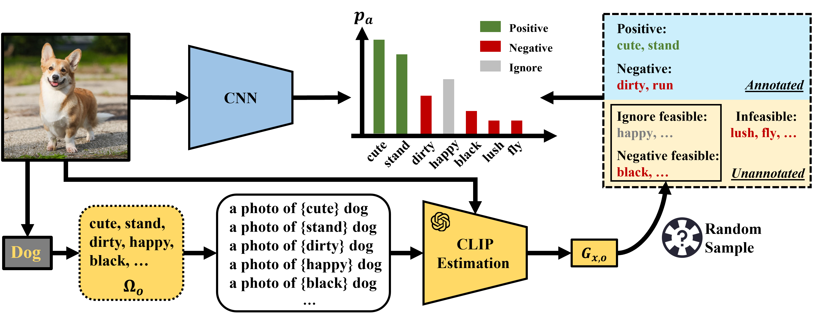

# Vision-language Guided Selective Loss
Project page for "Vision-Language Assisted Attribute Learning" (NIDC 2023)

## Abstract 

Attribute labeling at scale is typically incomplete and partial, posing significant challenges to model optimization. Existing attribute learning methods often treat the missing labels as negative or simply ignore them all during training, either of which could hamper the model performance to great extent. To overcome these limitations, in this paper we leverage the available vision-language knowledge to explicitly disclose the missing labels for enhancing model learning. Given an image, we predict the likelihood of each missing attribute label using an off-the-shelf vision-language model (e.g., CLIP), and randomly select to ignore those with high scores in training. Our strategy strikes a good balance between fully ignoring and negatifying the missing labels, as these high scores are found to be informative on revealing label ambiguity. Extensive experiments show that our proposed method can achieve state-of-the-art performance on the newly cleaned VAW dataset. 
Qualitative evaluation demonstrates the ability of the proposed method in predicting more complete attributes.

## Prediction Visualization

## Preparation

1. Download [VAW dataset](https://github.com/adobe-research/vaw_dataset) and [VG 1.4 dataset](https://visualgenome.org/).

2. Download relevant word embeddings at [Google Drive](https://drive.google.com/drive/folders/18M4F7vA0EOZqlp88E4W9gatQUTcSHYd6?usp=sharing), and put it under `data/embeddings/`.

3. Use `clean.ipynb` in `notebook/` to clean the original VAW dataset to get cleaned VAW dataset.

## Running

