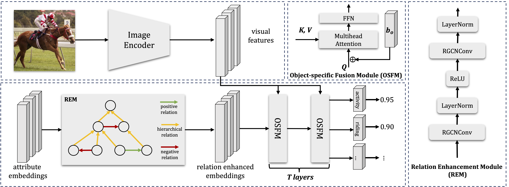

# Object-specific Attribute Relation Net
Project page for "Hierarchical Visual Attribute Learning in the Wild" (ACM MM 2023)

## Abstract 

Observing objects' attributes at different levels of detail is a fundamental aspect of how humans perceive and understand the world around them. Existing studies focused on attribute prediction in a flat way, but they overlook the underlying attribute hierarchy, e.g., navy blue is a subcategory of blue. In recent years, large language models, e.g., ChatGPT, have emerged with the ability to perform an extensive range of natural language processing tasks like text generation and classification. The factual knowledge learned by LLM can assist us build the hierarchical relations of visual attributes in the wild. Based on that, we propose a model called the object-specific attribute relation net, which takes advantage of three types of relations among attributes - positive, negative, and hierarchical - to better facilitate attribute recognition in images. Guided by the extracted hierarchical relations, our model can predict attributes from coarse to fine. Additionally, we introduce several evaluation metrics for attribute hierarchy to comprehensively assess the model's ability to comprehend hierarchical relations. Our extensive experiments demonstrate that our proposed hierarchical annotation brings improvements to the model's understanding of hierarchical relations of attributes, and the object-specific attribute relation net can recognize visual attributes more accurately.

## Model Architecture

## Prediction Visualization

